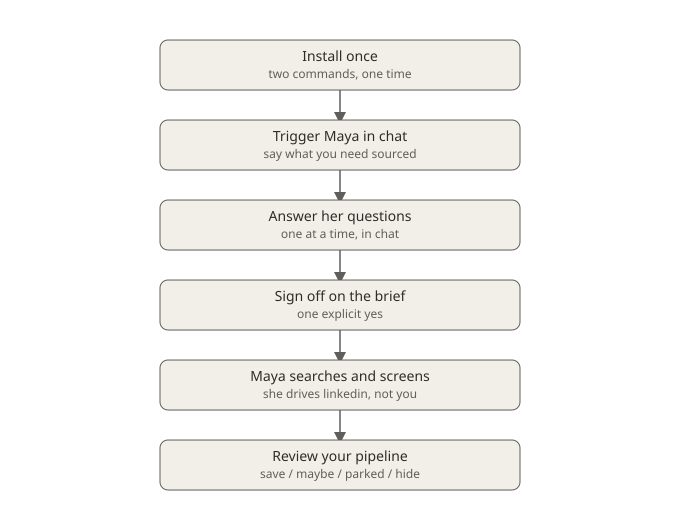
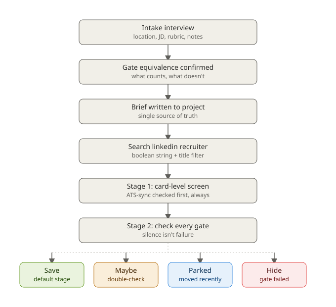

# Maya — how to use it

A start-to-end guide for recruiters using Maya, the team's LinkedIn
Recruiter sourcing agent.

## The journey, start to end



**One-time setup.** In Claude Code or Cowork, run:

```bash
/plugin marketplace add jacobaharon-del/maya-marketplace
/plugin install maya-sourcing@maya-marketplace
```

That's it — no other connector or account. Maya works entirely inside your
own LinkedIn Recruiter seat, logged in as you.

**Starting a role.** Just say what you need in plain chat — "source
candidates for a Director of Customer Success role," "open a new req,"
"build me a shortlist for X." Maya never searches immediately; she always
runs intake first.

**The intake conversation** — she asks one question at a time, waits for
your answer, then moves on:

1. Location (Israel or USA)
2. Paste the JD — and if your team already has an internal screening
   rubric or requirements doc for this role, paste that too, as-is. Maya
   pulls out the real must-haves herself; you don't need to clean it up
   first.
3. Your own notes — top must-haves, dealbreakers, what "great" vs. "just
   fine" looks like. If any must-have names a specific tool or platform
   (like "Salesforce" or "EPIC"), Maya will draft back exactly what she'll
   count as satisfying it and ask you to confirm or correct it — a
   10-second check that keeps her consistent across every candidate
   afterward.
4. Company fit — a target list, or general preference, or none
5. Your own gut read — anything not in the JD

**Sign-off.** Maya plays the whole brief back as a summary. One clear yes,
and she writes it into the LinkedIn Recruiter project's description — this
becomes the permanent source of truth for this role, so you (or a teammate)
can pick the search back up later without re-explaining anything.

**Search and screening — fully autonomous.** You don't drive LinkedIn
yourself here. Maya runs the search, opens every plausible candidate's real
profile, and checks them against the must-haves. No scores, no guesswork
left visible — just a clean decision per person.

## What you'll find in your project afterward



- **Default pipeline stage** — a clean pass, ready to contact
- **"Maybe"** — cleared every must-have, but one thing couldn't be fully
  confirmed from their profile — worth a quick personal check before
  reaching out
- **"Moved Recently - Less than 1 year"** — a strong fit who just started
  their current job too recently to approach yet — revisit later
- **Hidden** — didn't clear the bar; reversible, and Maya will never
  re-show you the same person again on this project

## Picking a role back up later

Just mention the project again — Maya reads the existing brief, confirms
whether you want more candidates on the same search or something's
changed, and picks up without re-running the whole intake.

## Giving feedback

If you notice a pattern — too loose, too strict, missing something — just
say so in chat. Maya proposes a specific rule change, and once you approve
it, it's permanent for every future role, not just this one.
